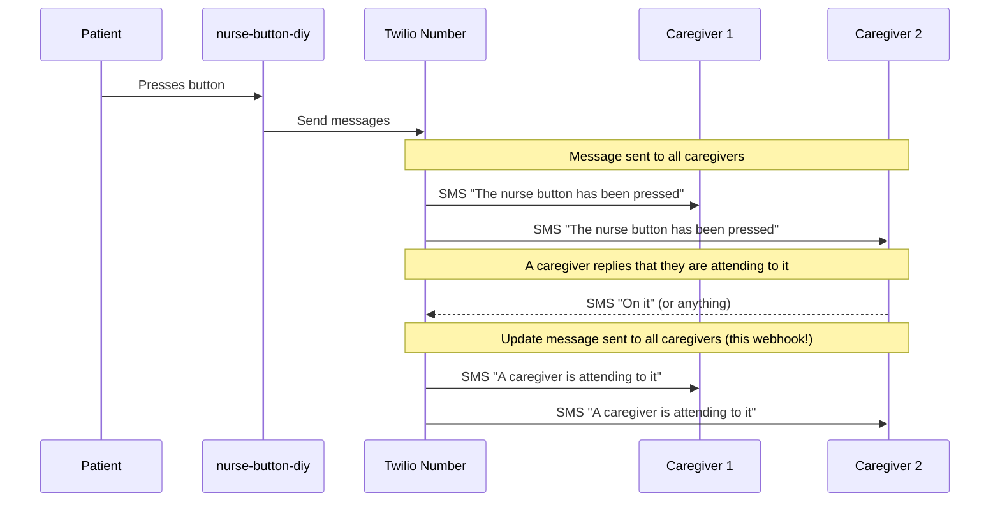

# nurse-button-webhook

[](https://nodejs.org/en)
[](https://www.twilio.com)
[](https://vercel.com)

This is a [Twilio webhook](https://www.twilio.com/docs/usage/webhooks), hosted on vercel as a [serverless function](https://vercel.com/docs/concepts/functions/serverless-functions). It works together with the [nurse-button-diy](https://github.com/jtaavola/nurse-button-diy) project. Any replies to the "nurse button has been pressed" Twilio message will trigger this webhook. It will message all designated recipients, letting everyone know that someone has acted upon the nurse button event.

The Twilio webhook is configured on the Twilio Console https://console.twilio.com



## Development

### `npm install -g vercel`

Installs the vercel CLI.

### `npm install`

Installs the necessary packages.

### Configure environment variables

Create a `.env` file at the root of the project to set the environment variables
```sh
# sid and auth token from https://console.twilio.com/
TWILIO_ACCOUNT_SID=<account_sid>
TWILIO_AUTH_TOKEN=<auth_token>
# phone numbers must be in E.164 format
TWILIO_FROM_NUMBER=+1234567890
# comma separate list of phone numbers to send the SMS to
TWILIO_TO_NUMBERS=+12345678901,+13456789012
```

> **Note**: You can also set development environment variables using the [vercel dashboard](https://vercel.com/docs/concepts/projects/environment-variables).

### `vercel dev`

The `vercel` cli is used to run the serverless functions locally. You will need to login to vercel and setup/link a vercel project. The `vercel dev` command will walk you through these steps.
